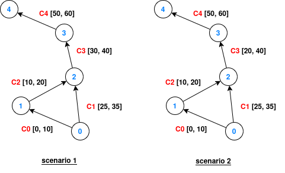

## Dijkstra Accuracy


### Run the example

This example requires the `contact_work_area` feature:
```bash
cargo run --example dijkstra_accuracy --features contact_work_area
```

### Scenarios

The implementation of Dijkstra over a time-varying graph shall be the core focus for the desired accuracy/computational speed tradeoffs.

This example covers the accuracy edge cases over the two following scenarios:



In scenario 1, the source is the node 0 and the destination is node 3. In the scenario 2, the destination is 4 and the contact C3 is altered to last from t=20 (prev.30) until t=40. Node 2 is a relay and shows 2 interfaces (it can receive and transmit simultaneously with 2 different nodes).


### Outcome

In both scenario, NodeGraph is unable to find the best existing path (SABR distance). Cause: each node can only have one parent, and the parent of node 2 will consistently be node 1 (best path to node 2 is C0 -> C2)

In the scenario 2, ContactGraph is unable to find the correct path. Cause: each contact can only have one parent, the parent of C3 is C2, because the best path to node 3 is C0 -> C2 -> C3.

Mpt finds the correct path for scenario 2. This approach allows a node to retain several parents (MPT stands for MultiPath Tracking). When a candidate path is detected, this candidate is retained for this node if at least one metric of the lexicographic cost appears better than the best candidates detected so far. A precise filtering and pruning mechanism allows Mpt to retain as few candidates as possible, to preserve high computational performance.